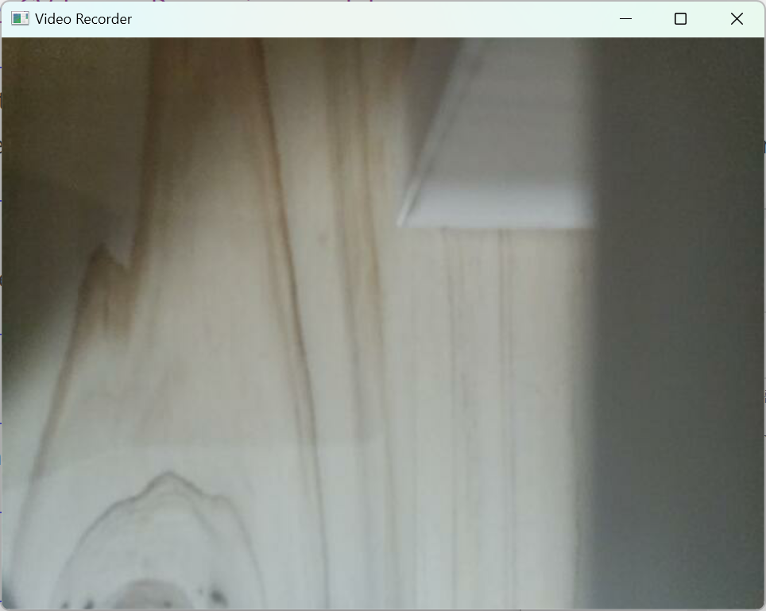
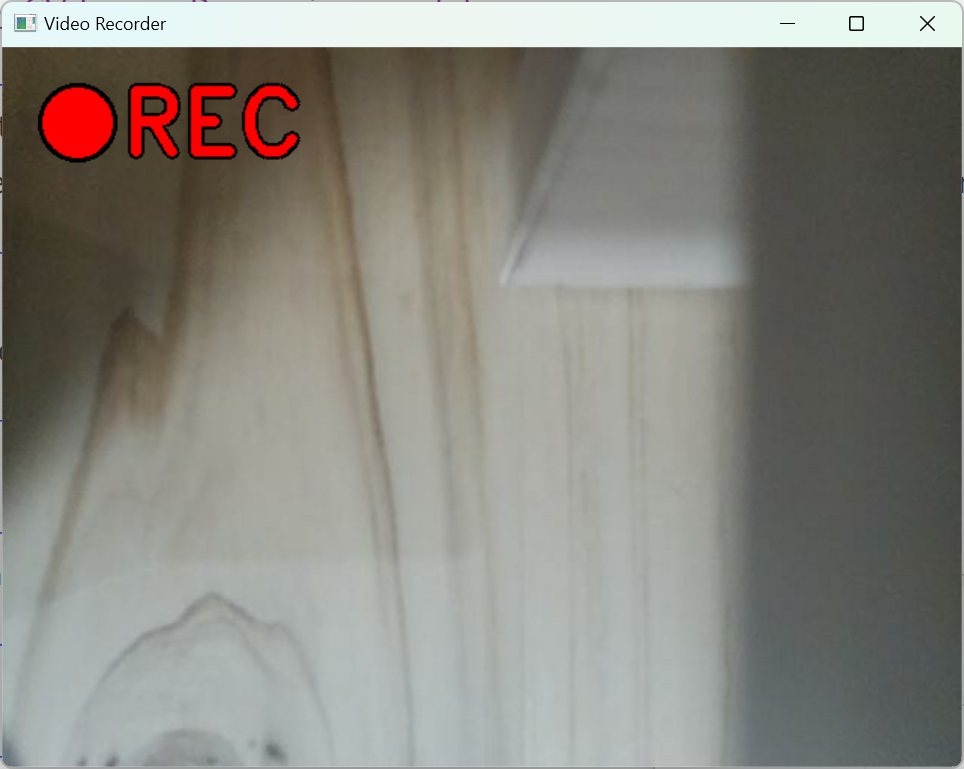
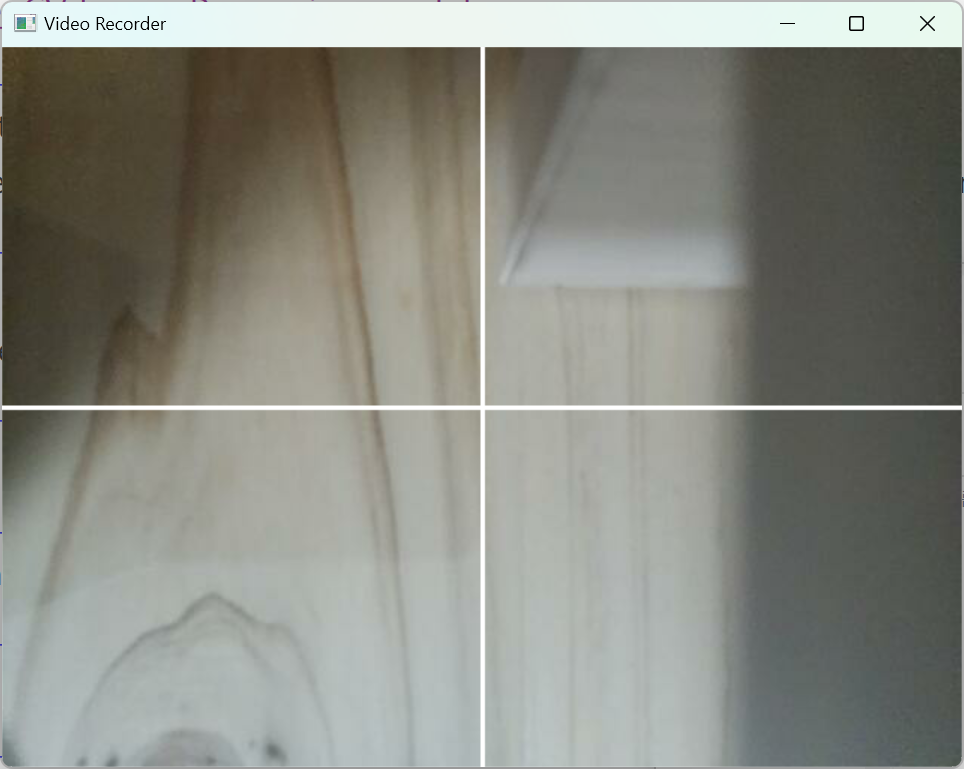

# Tiny Video Recorder

## 소개
OpenCV를 이용한 단순한 카메라 녹화 python 프로그램입니다.

## 동작
프로그램을 시작하면 기본 화면이 나타납니다. 

사용할 수 있는 단축키는 다음과 같습니다.
 - ESC: 프로그램을 종료합니다.
 - SPACE: 녹화를 시작하거나 종료합니다.
 - C: 십자선을 보여주거나 끕니다.

녹화 중에는 왼쪽 위에 'REC' 표시가 나타납니다. 
 
영상은 data 디렉토리 안에 저장됩니다.

C 키를 눌러 화면을 4분할하는 십자선을 켜고 끌 수 있습니다. 십자선은 녹화된 영상에도 보여집니다. 
